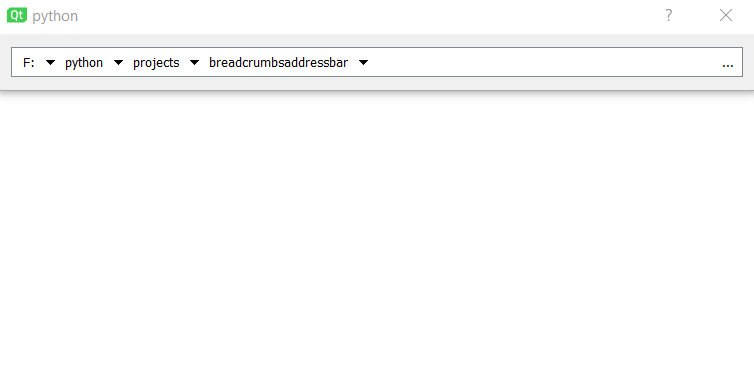

Address bar Qt widget with breadcrumb navigation

Depends on [QtPy](https://github.com/spyder-ide/qtpy) abstraction layer library.

Tested in Windows 10 only.

## Assets
* [Right Arrow](https://www.iconfinder.com/icons/211607/right_arrow_icon), MIT
* [Left Arrow](https://www.iconfinder.com/icons/211689/left_arrow_icon), MIT
